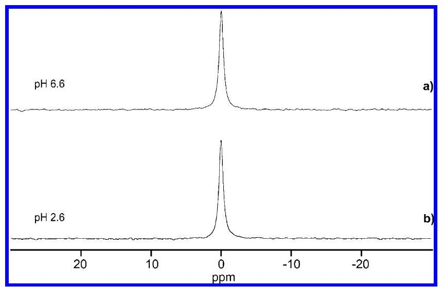
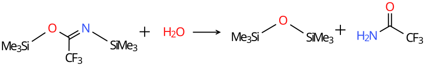

# Enrichment of $\mathrm{H}_{2}{ }^{\mathbf{1 7}} \mathrm{O}$ from Tap Water, Characterization of the Enriched Water, and Properties of Several ${ }^{17} \mathbf{0}$-Labeled Compounds 

Brinda Prasad, Andrew R. Lewis, and Erika Plettner* Department of Chemistry, Simon Fraser University, 8888 University Drive, Burnaby, BC, Canada - V5A 1 S6

## ABSTRACT

A low-abundance form of water, $\mathrm{H}_{2}{ }^{17} \mathrm{O}$, was enriched from $0.04 \%$ to $\sim \mathbf{9 0} \%$ by slow evaporation and fractional distillation of tap water. The density and refractive index for $\mathrm{H}_{2}{ }^{17} \mathrm{O}$ are reported. Gas chromatography-mass spectrometry (GC-MS) of ${ }^{16} \mathrm{O}$- and ${ }^{17} \mathrm{O}$-1-hexanols and their trimethyl silyl ethers and of ${ }^{16} \mathrm{O}$- and ${ }^{17} \mathrm{O}$-hexamethyl disiloxanes was used to determine the percentage of ${ }^{17} \mathrm{O}$ enrichment in the $\mathrm{H}_{2}{ }^{17} \mathrm{O}$. Furthermore, the chemical shifts of labeled and nonlabeled water dissolved in $\mathrm{CDCl}_{3}$ differed sufficiently that we could verify the enrichment of $\mathrm{H}_{2}{ }^{17} \mathrm{O} .{ }^{17} \mathrm{O}$ hexanol was synthesized by the reaction of iodohexane with $\mathrm{Na}^{17} \mathrm{OH} .{ }^{17} \mathrm{O}$-Labeled trimethylsilanol and ${ }^{17} \mathrm{O}$-labeled hexamethyldisiloxane were prepared by the reaction of $\mathrm{H}_{2}{ }^{17} \mathrm{O}$ with bis(trimethylsily)trifluoroacetamide (BSTFA). To generate standards for ${ }^{17} \mathrm{O}$ NMR, $\mathrm{H}_{2}{ }^{17} \mathrm{O}_{2}$, and ${ }^{17} \mathrm{O}$ camphor were prepared. $\mathrm{H}_{2}{ }^{17} \mathrm{O}$ was electrolyzed to form ${ }^{17} \mathrm{O}$-labeled hydrogen peroxide which was quantified using two colorimetric assays. ${ }^{17} \mathrm{O}$-Labeled camphor was prepared by exchanging the ketone oxygen of camphor using $\mathrm{H}_{2}{ }^{17} \mathrm{O}$. The ${ }^{17} \mathrm{O}$-labeled compounds were characterized using ${ }^{17} \mathrm{O},{ }^{1} \mathrm{H}$, and ${ }^{13} \mathrm{C}$ NMR and GC-MS. While we were characterizing the labeled camphor, we also detected an unexpected oxygen exchange reaction of primary alcohols, catalyzed by electrophilic ketones such as camphor. The reaction is a displacement of the alcohol OH group by water. This is an example of the usefulness of ${ }^{17} \mathrm{O}$ NMR in the study of a reaction mechanism that has not been noticed previously.

## INTRODUCTION

Dioxygen, $\mathrm{O}_{2}$, is central in many processes of life, such as photosynthesis and respiration. Many of the enzymatic mechanisms in anabolic and catabolic processes require $\mathrm{O}_{2}$ and generate oxygen-containing intermediates or products. Examples of enzymes that require oxygen atoms at some point in their catalytic cycles, either as $\mathrm{O}_{2}$, superoxide, $\mathrm{H}_{2} \mathrm{O}_{2}$, or water, include three important groups. First are the hemecontaining enzymes, such as cytochromes P450, ${ }^{1,2}$ [^0] cyclooxygenase, ${ }^{3,4}$ dioxygenases, ${ }^{5,6}$ or NO synthases. ${ }^{7}$ Second are flavincontaining oxidoreductases, ${ }^{8}$ such as putrescine oxidase or Baeyer-Villigerases, ${ }^{9}$ and third are nonheme iron-containing enzymes, such as fatty acid desaturases. ${ }^{10}$ Despite its high (1.229 V ) oxidation potential, dioxygen is not very reactive under standard conditions in living organisms because $\mathrm{O}_{2}$ is in the triplet ground state, whereas most metabolites are in a singlet ground state. The superoxide ion, $\mathrm{O}_{2}^{-}$, is formed through a one-electron reduction of $\mathrm{O}_{2}$. Upon a further reduction and protonation, superoxide forms hydrogen peroxide, $\mathrm{H}_{2} \mathrm{O}_{2}$, a mild oxidant or reductant. ${ }^{11}$ Further reduction and protonation yields water, the least reactive oxygen species in this chain. The enzymes listed above exploit the differential reactivities in this chain of oxygen species, from $\mathrm{O}_{2}$ to water in their catalysis. The reduction of $\mathrm{O}_{2}$ to water $\left(\mathrm{O}_{2}+4 \mathrm{e}^{-}+4 \mathrm{H}^{+} \rightarrow 2 \mathrm{H}_{2} \mathrm{O}, \Delta G\right.$ $=-474 \mathrm{~kJ} / \mathrm{mol})^{12}$ is highly exothermic, and cytochromes P450 or fatty acid desaturases exploit this property, utilizing the free energy released in the reduction of $\mathrm{O}_{2}$ to activate hydrocarbon $\mathrm{C}-\mathrm{H}$ bonds. These enzymes accomplish this feat of thermodynamic coupling by coordinating with $\mathrm{O}_{2}$ and reducing it in a stepwise manner. Some reactive oxygen species are sometimes released prematurely from these enzymes, leading to oxidative stress in the cell. ${ }^{13}$ It is, therefore, of interest to study how the various oxygen species interact with enzymes.

Oxygen has three stable isotopes: ${ }^{16} \mathrm{O}$ (abundance 99.759\%), ${ }^{17} \mathrm{O}(0.037 \%)$ and ${ }^{18} \mathrm{O}(0.204 \%) .{ }^{16} \mathrm{O}$ and ${ }^{18} \mathrm{O}$ have a nuclear spin (I) of zero whereas ${ }^{17} \mathrm{O}$ has $I=5 / 2$ which makes it detectable by NMR spectroscopy. ${ }^{14}$ Pure $\mathrm{H}_{2}{ }^{17} \mathrm{O}$ is the commonly accepted reference standard ${ }^{15}$ for the chemical shifts in ${ }^{17} \mathrm{O}$ NMR. [^1] ${ }^{17} \mathrm{O}$ chemical shifts span a range -30 to +600 ppm$\mathrm{}^{16}$ which makes distinguishing functional groups containing oxygen (bonded to carbon, nitrogen, or sulfur) relatively straightforward, despite the low abundance and high cost of ${ }^{17} \mathrm{O}$. Due to the lack of interferences, enzymatic samples can, in principle, be studied directly by ${ }^{17} \mathrm{O}$ NMR without the need to remove the protein, making it a practical tool for mechanistic studies. ${ }^{17} \mathrm{O}$ NMR studies have enormous applications in chemistry and biology. For example, Gullion et al. ${ }^{17}$ have reported the determination of secondary structures in polyamides by ${ }^{13} \mathrm{C}-{ }^{17} \mathrm{O}$ READPOR NMR. ${ }^{17} \mathrm{O}$ NMR is also used in imaging analysis to determine the cerebral metabolic rate of oxygen in rats. ${ }^{18}$

Commercially available $\mathrm{H}_{2}{ }^{17} \mathrm{O}$ is prohibitively expensive (1 g of $90 \%$ enriched $\mathrm{H}_{2}{ }^{17} \mathrm{O}$ costs $>\$ 2000$ ), and in order to facilitate and expand the use of ${ }^{17} \mathrm{O}$-labeling studies in enzymatic reactions, there is a need for an economical method by which researchers can enrich ${ }^{17} \mathrm{O}$ from water and characterize the isotopic enrichment in a simple and reliable way. In this paper we describe an inexpensive method for enriching both $\mathrm{H}_{2}{ }^{17} \mathrm{O}$ and $\mathrm{H}_{2}{ }^{18} \mathrm{O}$ in tap water using slow evaporation followed by fractional distillation. We also report simple procedures to determine the percentage of isotopic enrichment of ${ }^{17} \mathrm{O}$-labeled water using gas chromatography-mass spectroscopy (GC-MS) of 1-hexanol and hexamethyldisiloxane (HMDS) synthesized from $\mathrm{H}_{2}{ }^{17} \mathrm{O}$ and deionized water. The fractional distillation method reported here is based on the differences in the volatility of the three forms of water that vary in their oxygen isotope. ${ }^{19-21}$

In our research group we use the isotope-enriched water for the study of enzymatic reactions of $\mathrm{P} 450_{\text {cam }}$, a camphor hydroxylase. We therefore also describe the preparation of ${ }^{17} \mathrm{O}$-labeled hydrogen peroxide by the electrolysis of $\mathrm{H}_{2}{ }^{17} \mathrm{O}$, synthesis of ${ }^{17} \mathrm{O}$-labeled camphor and report the ${ }^{1} \mathrm{H},{ }^{13} \mathrm{C}$, and ${ }^{17} \mathrm{O}$ NMR data for ${ }^{17} \mathrm{O}$ 1-hexanol, ${ }^{17} \mathrm{O}$ camphor, ${ }^{17} \mathrm{O}$ trimethylsilanol, and ${ }^{17} \mathrm{O}$ hexamethyldisiloxane. Furthermore, while studying the labeled camphor in $\mathrm{H}_{2}{ }^{17} \mathrm{O}$, we detected an unusual ${ }^{17} \mathrm{O}$ exchange into the ethanol that was used to deliver camphor into the water. This is an important example that illustrates how ${ }^{17} \mathrm{O}$ NMR can provide insight into reactions that may otherwise have gone unnoticed. [^2] 

## EXPERIMENTAL SECTION

**Enrichment of $\mathbf{H}_{\mathbf{2}}{ }^{\mathbf{1 7}} \mathbf{O}$ from Tap Water.** Tap water (~1-2 L) was placed in a shallow black bowl and left to evaporate slowly at room temperature on a windowsill. When the water in the bowl reached ca. 20-50 mL, it was collected into a measuring cup and briefly boiled in a microwave (~ 30 s high power) to kill any bacteria that may have accumulated. The sterilized enriched water was stored in a glass jar with a tight lid. This process was repeated until more than 1 L of enriched water had been accumulated. The water was filtered through fluted filter paper (Whatman Cat. No.1001-070), to remove any particulate matter, and ~500 mL of this was placed in a 1 L round-bottom flask, fitted with two condensers (Supporting Information Figure S1), for fractional distillation.

**Fractional Distillation of the Enriched Water.** The vertical condenser was packed with glass wool and was not cooled with running water. The tilted condenser at the top had cold water running to condense the distillate. The system was attached to a single-neck still head that could be rotated easily in order to allow various fractions of water to be collected without interrupting the distillation. The distillation source flask was heated with a mantle connected to a Variac (setting: 50). To ensure good fractionation, it was important that the water was not heated too quickly.

The boiling point was monitored using a thermometer at the top of the fractionation column (Supporting Information Figure S1), and several fractions with different boiling points were collected. Temperatures given are not corrected. For reference, the SFU Burnaby campus lies 370 m above sea level, and the boiling point of tap water registers at $97^{\circ} \mathrm{C}$ in our apparatus at this location. Fractions having boiling points of $98.5^{\circ} \mathrm{C}(10 \mathrm{~mL} \times$ 6) and $99{ }^{\circ} \mathrm{C}(10 \mathrm{~mL})$ were collected.

**Preparation of Hydrogen Peroxide by the Electrolysis of Water.** Hydrogen peroxide is a redox-active compound that is most commonly encountered as an oxidant. ${ }^{22}$ Industrially, anthraquinone is hydrogenated to form anthrahydroquinone which is further oxygenated to form hydrogen peroxide. ${ }^{23}$ Other methods for synthesizing $\mathrm{H}_{2} \mathrm{O}_{2}$ include hydrolysis of peracids (e.g., peracetic acid), ${ }^{24}$ and enzymatic hydrolysis of phosphatidic acid to glycerol-3-phosphate (G3P), which is then oxidized by G3P oxidase to hydrogen peroxide. ${ }^{25}$ Catalytic methods of production using palladium membranes ${ }^{26}$ and zirconium catalysts ${ }^{27}$ have also been reported. Several electrolytic methods for hydrogen peroxide generation have been reported in the literature, including a fuel-cell method, ${ }^{28-30}$ electrolysis of water using a carbon cathode, and a $\mathrm{RuO}_{2}$-based titanium anode, ${ }^{31}$ using a solid-polymer electrolyte ${ }^{32}$ or using a proton-exchange membrane. ${ }^{33}$ We required a method that uses $\mathrm{H_{2}O},$ and so we selected electrolysis. [^1] 

In our method, the electrolysis of 5 mL of $\mathrm{H}_{2}{ }^{17} \mathrm{O}$ buffered to pH 7.7 using 50 mM phosphate buffer (made from 50 mM $\mathrm{KH}_{2} \mathrm{PO}_{4}$ and 50 mM $\mathrm{K}_{2} \mathrm{HPO}_{4}$ ) with 150 mM KCl was carried out using a copper cathode and a graphite anode. The electrodes were connected to a Biorad Power Pac 1000 and a constant voltage of 5 V was applied for one hour. The reaction was monitored by observing the redox properties of $\mathrm{H}_{2} \mathrm{O}_{2}$ in two different reactions (quantitation details of $\mathrm{H}_{2} \mathrm{O}_{2}$ in the Supporting Information).

**${ }^{17} \mathrm{O}$ NMR of Water.** The proton decoupled ${ }^{17} \mathrm{O}$ NMR of the water sample (pH 6.6) was obtained with $\mathrm{CDCl}_{3}$ lock in a coaxial capillary, recycle delay 0.2 s and the chemical shift was set to 0 ppm . (Figure 1a). Another $\mathrm{H}_{2}{ }^{17} \mathrm{O}$ sample containing buffer (pH 2.6) was also run in the same fashion to see if there is any variation in the chemical shift with pH (Figure 1b). NMR acquisition conditions are included in the experimental details of the Supporting Information.

**Figure 1.** ${ }^{17} \mathrm{O}$ NMR spectrum of water samples: (a) pH 6.6, (b) pH 2.6.

**Synthesis of Labeled 1-Hexanol and Hexamethyldisiloxane.** The ${ }^{17} \mathrm{O}$-labeled water could not be run directly on a gas chromatograph - mass spectrometer because the fusedsilica capillary column would have been damaged by the water. We chose to prepare labeled 1-hexanol because smaller alcohols are hard to detect by GC-MS (weak molecular ion peak and high volatility) and higher alcohols give more complex fragmentation patterns. ${ }^{17}$ O-Labeled hexanol was synthesized by reacting the ${ }^{17} \mathrm{O}$-enriched water with sodium metal, followed by addition of 1-iodohexane. Briefly, $200 \mu \mathrm{~L}$ (0.2 mmol) of ${ }^{17} \mathrm{O}$ water was reacted with 3 $\mathrm{mg}(0.13 \mathrm{mmol})$ of sodium metal (Scheme 1). When the metal had all reacted, 1 equiv of 1-iodohexane ( $10 \mu \mathrm{~L}$ was dissolved in $100 \mu \mathrm{~L}$ of acetone) was added, and the reaction mixture was stirred at room temperature for 3 h . The reaction was monitored every 30 min by GC-MS, and after 3 h , complete depletion of 1-iodohexane was observed.

**Scheme 1. Formation of ${ }^{17} \mathbf{O}$-Labeled Hexanol by a $\mathbf{S}_{\mathbf{N}}{ }^{2}$ Reaction**

$$\ce{2Na + 2H2^{17}O -> 2Na^{17}OH + H2 ^}$$  
$$\mathrm{2Na~+~2H_2{}^{17}O~\longrightarrow~2Na^{17}OH~+~H_2}$$

A solution ($1 \mu \mathrm{L}$ diluted 1000-fold with distilled hexane) of the 1-hexanol was injected into a Varian 3800 GC, equipped with a 30 m SPB- 5 column (i.d. $=0.25 \mathrm{mm}, 0.25 \mu \mathrm{m}$ film thickness, Supelco) interfaced with a Varian Saturn 2000 ion trap mass spectrometer. The trimethylsilyl ether of 1-hexanol was prepared by reacting $0.5 \mu \mathrm{L}$ of 1 -hexanol in a small ampule with $4 \mu \mathrm{L}$ of bis(trimethylsilyl)triflouroacetamide (BSTFA, Sigma) for 40 min at RT, and the reaction mixture was diluted with hexane ( $1000 \times$ ) for the injection of $1 \mu \mathrm{~L}$ on the GC-MS. (The column oven settings are included in the experimental details of the Supporting Information).

To form hexamethyldisiloxane, HMDS (or bis-trimethylsilyl oxide) (Scheme 2), $0.5 \mu \mathrm{~L}$ of deionized water and $\mathrm{H}_{2}{ }^{17} \mathrm{O}$ were each treated with $5 \mu \mathrm{~L}$ of BSTFA for 40 min at $60^{\circ} \mathrm{C}$. For HMDS GC-MS analysis, ion storage (SIS mode) was used, and $m / z 135-150 \mathrm{amu}$ was scanned. For ${ }^{17} \mathrm{O}$ NMR studies, $300 \mu \mathrm{~L}$ of BSTFA was treated with $25 \mu \mathrm{~L}$ of $\mathrm{H}_{2}{ }^{17} \mathrm{O}$ in a small ampule and left overnight at RT. About $300 \mu \mathrm{~L}$ of pentanol was added the next day, the organic extract was concentrated at RT, and $450 \mu \mathrm{~L}$ of $\mathrm{CDCl}_{3}$ was added. In our NMR studies, ${ }^{17}$ O-labeled trimethylsilanol, ${ }^{17} \mathrm{O}$-labeled hexamethyldisiloxane (HMDS), and ${ }^{17} \mathrm{O}$-labeled trifluoroacetamide (reaction byproduct) were detected.

**Scheme 2. Hydrolysis Reaction of BSTFA To Form Hexamethyldisiloxane (HMDS)**

**Preparation of ${ }^{17} \mathbf{O}$ Camphor.** Camphor (7 mg) was dissolved in 0.5 mL of $\mathrm{CDCl}_{3}$ and added to $50 \mu \mathrm{~L}$ of $\mathrm{H}_{2}{ }^{17} \mathrm{O}$ buffer (50 mM phosphate, pH 7.7) in an NMR tube (diameter: 5 mm). The mixture was left to react at room temperature overnight and analyzed directly by ${ }^{17} \mathrm{O}$ NMR the next day. After NMR, a sample was extracted and checked by EI GC-MS (The GC-MS data of ${ }^{17} \mathrm{O}$-labeled camphor is included in the Supporting Information).

## RESULTS AND DISCUSSION

Density and Refractive Index. The density and refractive index experimental details are included in the Supporting Information. The density of deionized water was found to be $0.9986 \pm$ $0.0006 \mathrm{~g} / \mathrm{cm}^{3}$ and of $\mathrm{H}_{2}{ }^{17} \mathrm{O}$ fraction 11 (99\%) $1.0026 \pm 0.0010$ at $21^{\circ} \mathrm{C}$. This increase in density for $\mathrm{H}_{2}{ }^{17} \mathrm{O}$ is significant $(P=$ $0.014, t$ test, five replicates) and expected from the observation that $\mathrm{H}_{2}{ }^{18} \mathrm{O}\left(99\right.$ atom $\left.{ }^{18} \mathrm{O} \%\right)$ has a reported density of $1.11 \mathrm{~g} / \mathrm{mL}$ at $20^{\circ} \mathrm{C}$. ${ }^{34}$

The refractometer was calibrated with ethanol whose refractive index was found to be 1.3605 , as reported in the literature. ${ }^{35}$ For deionized water, the refractive index was measured to be 1.3321, and for $\mathrm{H}_{2}{ }^{17} \mathrm{O}$, it was 1.3318. The literature value for $\mathrm{H}_{2}{ }^{16} \mathrm{O}$ is reported to be $1.33300^{36}$ The refractive index of $\mathrm{H}_{2}{ }^{17} \mathrm{O}$ has not been reported previously according to our knowledge.

Determination of the Percentage of $\mathrm{H}_{\mathbf{2}}{ }^{\mathbf{1 7}} \mathrm{O}$ in the Fractions from Distillation. We prepared two compounds to assess the percentage of $\mathrm{H}_{2}{ }^{17} \mathrm{O}$ in the fractions obtained from distillation: 1-hexanol and hexamethyldisiloxane (HMDS). The percentage of labeling was calculated using the integrated peak areas of the molecular ion ( $\mathrm{M}^{+}$, for 1-hexanol) or a prominent fragment ion ( $\mathrm{M}-16$, for HMDS ) of

[^2]
## Scheme 3. Fragmentation Analysis of Hexamethyldisiloxane under GC-MS Conditions

nonlabeled and ${ }^{17} \mathrm{O}$-labeled compounds. The natural isotope abundance corrections were done by using nonlabeled compound standards.

For nonlabeled 1-hexanol, the natural abundance of the $\mathrm{M}+$ 1 mass can be calculated by:

$$
L_{\text {nat }}=\frac{A_{175}}{A_{174}+A_{175}} \times 100
$$

where $L_{\text {nat }}$ is the natural abundance of the M +1 peak in the mass spectrum (due to ${ }^{13} \mathrm{C},{ }^{2} \mathrm{H}$, and ${ }^{17} \mathrm{O}$ ), $A_{175}$ is the area of the peak with $m / z 175(\mathrm{M}+1)$ at the retention time of 1-hexanol, and $A_{174}$ is the area of the peak with $m / z 174\left(\mathrm{M}^{+}\right)$.

The percentage of ${ }^{17} \mathrm{O}$ in labeled hexanol is:

$$
L_{17 \mathrm{gross}}=\frac{A_{175}}{A_{174}+A_{175}} \times 100
$$

The net percentage of ${ }^{17} \mathrm{O}$ in the tested 1-hexanol is:

$$
L_{17 \mathrm{net}}=\left(L_{17 \mathrm{gross}}-L_{\text {nat }}\right)
$$

The labeling of ${ }^{17} \mathrm{O}$ in 1 -hexanol was found to be $94.07 \%$ by this method. To obtain another ${ }^{17} \mathrm{O}$-labeled compound from water, we treated water (deionized $\mathrm{H}_{2}{ }^{16} \mathrm{O}, \mathrm{H}_{2}{ }^{17} \mathrm{O}$ ) and the residue from the fractional distillation (which should contain large quantities of $\mathrm{H}_{2}{ }^{18} \mathrm{O}$ ) with BSTFA to obtain the BSTFA hydrolysis product hexamethyldisiloxane (HMDS). The percentages of ${ }^{17} \mathrm{O}$ and ${ }^{18} \mathrm{O}$ in HMDS can be calculated in the same fashion as described for 1-hexanol, except that the relevant ion is $\mathrm{M}-\mathrm{CH}_{4}$ (Scheme 3), i.e., 146 (for ${ }^{16} \mathrm{O}$ ), 147 (for ${ }^{17} \mathrm{O}$ ), and 148 (for ${ }^{18}$ ).

The natural abundances of one or two extra mass units are $L_{\text {nat }+1}$ and $L_{\text {nat }+2}$ are, respectively.

$$
\begin{aligned}
& L_{\text {nat }+1}=\frac{A_{147}}{A_{146}+A_{147}+A_{148}} \times 100 L_{\text {nat }+2}= \\
& \frac{A_{148}}{A_{146}+A_{147}+A_{148}} \times 100
\end{aligned}
$$

The gross labeling in HMDS from the distillate can be calculated by:

$$
\begin{aligned}
L_{\text {gross }+1}=\frac{A_{147}}{A_{146}+A_{147}+A_{148}} \times 100 L_{\text {gross }+2} & = \\
& \frac{A_{148}}{A_{146}+A_{147}+A_{148}} \times 100
\end{aligned}
$$

Table 1. Percentage of Oxygen Isotopes ( ${ }^{16} \mathrm{O},{ }^{17} \mathrm{O}$ and
${ }^{18} \mathrm{O}$ ) and Boiling Points for the Water Samples Obtained from the Fractional Distillation

| boiling      sample   point $\left({ }^{\circ} \mathrm{C}\right)^{a}$ |  |  |  |  |  |
| :--- | :---: | :---: | :---: | ---: | ---: |
| approx.   vol $(\mathrm{mL})$ | $\%{ }^{16} \mathrm{O}^{b}$ | $\%{ }^{17} \mathrm{O}^{c}$ | $\%{ }^{18} \mathrm{O}^{d}$ |  |  |
| deionized water | 97.0 | - | 99.7 | 0.1 | 0.2 |
| fraction \#5 | 98.5 | 60 | 0.2 | 99.1 | 0.7 |
| fraction \#11 | 99.0 | 10 | $\mathrm{ND}^{e}$ | 99.7 | 0.3 |
| residue | - | $\sim 100$ | 13.0 | 29.7 | 57.3 |

${ }^{a}$ The boiling points of the water fractions collected from the fractional distillation. ${ }^{b}$ Percentage of the ${ }^{16} \mathrm{O}$ isotope. ${ }^{c}$ Percentage of the ${ }^{17} \mathrm{O}$ isotope. ${ }^{d}$ Percentage of the ${ }^{18} \mathrm{O}$ isotope. ${ }^{e} \mathrm{ND}=$ Not detected.

The net ${ }^{17} \mathrm{O}$ in HMDS is:

$$
L_{1 \text { nnet }}=\left(L_{\text {gross }+1}-L_{\text {nat }+1}\right)
$$

and the net ${ }^{18} \mathrm{O}$ in HMDS is:

$$
L_{18 \mathrm{net}}=\left(L_{\text {gross }+2}-L_{\text {nat }+2}\right)
$$

In the trimethylsilyl (TMS)-containing compounds, ${ }^{29} \mathrm{Si}$ (natural abundance relative to ${ }^{28} \mathrm{Si}, 5.10 \%$ ) makes a contribution to the " +1 " mass peak and ${ }^{30} \mathrm{Si}$ (abundance $3.35 \%$ ) makes a significant contribution to the " +2 " mass peak. ${ }^{37}$ The results of this analysis are shown in Table 1. The higher the boiling point of a fraction, the higher the ${ }^{17} \mathrm{O}$ content in the distillate. As expected, the residue contained a high percentage of $\mathrm{H}_{2}{ }^{18} \mathrm{O}$.
${ }^{17} \mathrm{O}$ NMR. Water. The effect of dissolved ions on the ${ }^{17} \mathrm{O}$ chemical shift of water has been described by Li et al. ${ }^{38,39}$ who measured the ${ }^{17} \mathrm{O}$ chemical shift of $\mathrm{H}_{2}{ }^{17} \mathrm{O}$ with HCl and NaOH concentrations ranging from 0 to $1.0 \mathrm{~mol} / \mathrm{L}$. They reported a linear correlation between the ${ }^{17} \mathrm{O}$ chemical shift and the acid (or base) concentration. These authors also demonstrated the effect of concentration of $\mathrm{NaCl}, \mathrm{KCl}, \mathrm{Na}_{2} \mathrm{CO}_{3}, \mathrm{NaHCO}_{3}, \mathrm{Na}_{2} \mathrm{SO}_{4}$, and $\mathrm{MgSO}_{4}$ on the ${ }^{17} \mathrm{O}$ chemical shift of $\mathrm{H}_{2}{ }^{17} \mathrm{O}$ and observed a linear variation in all cases.

We measured the ${ }^{17} \mathrm{O}$ chemical shift of water for a series of samples adjusted to various pH values using dilute phosphate buffers (buffer concentration was kept constant) and did not observe any variation (Figure 1a and 1b).

Sodium Hydroxide, Hexanol, HMDS, Trimethylsilanol, and Trifluoroacetamide. The ${ }^{17} \mathrm{O}$ chemical shift of labeled sodium
(37) Silverstein, R. M.; Bassler, G. C.; Morrill, T. C. Spectrometric Identification of Organic Compounds; John Wiley \& Sons: New York, 1981; p 10.
(38) Li, R. H.; Jiang, Z. P.; Shi, S. Q.; Yang, H. W. I. Mol. Struct. 2003, 645, 69-75.
(39) Li, R. H.; Jiang, Z. P.; Yang, H. W.; Guan, Y. T. I. Mol. Liq. 2006, 126, 14-18.

Figure 2. ${ }^{17} \mathrm{O}$ NMR spectra of (a) labeled sodium hydroxide, (b) labeled 1-hexanol, (c) labeled trimethylsilanol, and hexamethyldisiloxane. The $\mathrm{H}_{2}{ }^{17} \mathrm{O}$ peak (marked ${ }^{*}$, set to 0 ppm ) is an external standard and was used to calibrate the chemical shift scales.

Scheme 4. Exchange of Labeled Trifluoroacetamide as a Side Product in BSTFA Hydrolysis of Water

hydroxide ( $\sim 0.5 \mathrm{M}$ ) was 8.8 ppm (Figure 2a). The chemical shifts of other ${ }^{17} \mathrm{O}$-labeled compounds were -4.16 ppm for $1-{ }^{17} \mathrm{O}$ hexanol (Figure 2b), 38.5 ppm for ${ }^{17} \mathrm{O}-\mathrm{HMDS}$ (Figure 2c), 17.7 ppm for trimethylsilanol (Figure 2c), and 310.0 ppm for trifluoroacetamide (Figure 2c). Formation of the latter compound during the hydrolysis of BSTFA suggests that the amide carbonyl oxygen can exchange with the oxygen from added water (Scheme 4). The chemical shifts of trimethylsilanol in acetone- $d_{6}$ was reported to be 12.6 ppm which agrees with our result. ${ }^{40}$

Camphor. To further explore the NMR properties of the ${ }^{17} \mathrm{O}$ label, camphor was exchanged with ${ }^{17} \mathrm{O}$-enriched water. The ${ }^{17} \mathrm{O}$ chemical shift of this camphor solution dissolved in $\mathrm{CDCl}_{3}$ was 502.4 ppm (Figure 3a) (Scheme 5). When a $1 \mathrm{M}^{17} \mathrm{O}$-labeled camphor solution in ethanol was exchanged with ${ }^{17} \mathrm{O}$-enriched water, the chemical shift of camphor was found to be 499 ppm (Figure 3b) (Scheme 6a). The camphor peak seemed to be small, and surprisingly an intense peak at 11 ppm (Figure 3b) was also observed which corresponds to ${ }^{17} \mathrm{O}$-labeled ethanol. Previous literature studies for primary and secondary alcohols suggest a chemical shift of -3 to $+10 \mathrm{ppm} .{ }^{41}$ The chemical shift was confirmed with a control experiment in which ethanol was dissolved in $\mathrm{H}_{2}{ }^{17} \mathrm{O}$, and a similar peak at 11 ppm was observed due to slow exchange. (Figure 3c) (Scheme 6b). Surprisingly, the intensity of this peak was significantly smaller than in the

[^3]

Figure 3. ${ }^{17} \mathrm{O}$ NMR spectra of (a) labeled camphor dissolved in $\mathrm{CDCl}_{3}$ with an external $\mathrm{H}_{2}{ }^{17} \mathrm{O}$ standard (*), (b) labeled camphor dissolved in ethanol with $\mathrm{H}_{2}{ }^{17} \mathrm{O}$, (c) labeled ethanol with $\mathrm{H}_{2}{ }^{17} \mathrm{O}$, and (d) labeled cyclohexanone dissolved in ethanol with $\mathrm{H}_{2}{ }^{17} \mathrm{O}$ added.

## Scheme 5. Formation of Labeled Camphor in $\mathrm{CDCl}_{3}$

presence of camphor. This suggests that labeled ethanol formation can occur due to its exchange with $\mathrm{H}_{2}{ }^{17} \mathrm{O}$ and also when ethanol attacks the keto group of ${ }^{17} \mathrm{O}$-labeled camphor, to form the hemiacetal of camphor. An attack of $\mathrm{H}_{2}{ }^{17} \mathrm{O}$ on $\mathrm{C}-1$ of ethanol can then take place, and when the hemiacetal collapses, labeled ethanol is formed. To determine if a similar nucleophilic attack on hemiacetal moieties can happen for ketones less strained than camphor, a 1 M solution of cyclohexanone in ethanol was exchanged with $\mathrm{H}_{2}{ }^{17} \mathrm{O}$ (Figure 3d) (Scheme 6c), and two peaks appeared: one at 540 ppm corresponding to the labeled cyclohexanone as reported in the literature ${ }^{16}$ and another at 11 ppm corresponding to labeled ethanol. The intensity of the ketone peak for labeled cyclohexanone was higher than that of labeled camphor. Conversely, the intensity of labeled ethanol was smaller relative to water in the cyclohexanone sample than in the camphor reaction mixture, suggesting that camphor catalyzes the exchange of the ethanol OH group more effectively than cyclohexanone. A possible reason for this could be that the camphor carbonyl carbon is more electrophilic than that of cyclohexanone, because of strain

Scheme 6. (a) Reaction of Camphor Solution in Ethanol with ${ }^{17} 0$-Enriched Water. (b) Reaction of Ethanol with ${ }^{17} \mathbf{O}$-Enriched Water. (c) Reaction of Cyclohexanone Solution in Ethanol with ${ }^{17}$ O-Enriched Water

in the bicyclic ring system. ${ }^{42}$ This would cause the hemiacetal to form more readily with camphor than with cyclohexanone, and a higher concentration of hemiacetal would lead to a higher probability of alcohol exchange reaction. Thus, the carbonyl exchange reaction is potentially useful for the labeling of compounds, but it also needs to be taken into account when studying metabolic pathways by oxygen labeling.

Hydrogen Peroxide. For our research with P450, we also prepared labeled $\mathrm{H}_{2}{ }^{17} \mathrm{O}_{2}$ by electrolysis. The hydrogen peroxide had an ${ }^{17}$ O chemical shift of 179 ppm (Figure 4), in agreement with the value previously reported in the literature. ${ }^{43}$

Formation of Labeled Alcohols by Exchange with $\mathbf{H}_{2}{ }^{\mathbf{1 7}} \mathrm{O}$ Involves a $\mathrm{S}_{\mathrm{N}} 2$ Mechanism. To determine whether the ethanol OH exchange reaction shown in Scheme 6 does involve attack of water on the primary alcohol carbon, the exchange reaction of camphor dissolved in hexanol with $\mathrm{H}_{2}{ }^{17} \mathrm{O}$ was tried. If attack of water occurs with concomitant expulsion of the camphor oxygen (Scheme 7), then 1-hexanol should form cleanly. If, however, the reaction involves the formation of a carbocation (i.e.,

Figure 4. ${ }^{17} \mathrm{O}$ NMR spectrum of labeled hydrogen peroxide.
if attack 'b' in scheme 7 occurs prior to attack 'a'), then 2-hexanol should form by rearrangement of the primary carbocation. The reaction yielded labeled hexanol by ${ }^{17} \mathrm{O}$ NMR, and comparison to standards of 1-hexanol and 2-hexanol using GC-MS revealed that only 1-hexanol had formed. This confirms that the formation of labeled alcohols by the exchange reaction described above involves a $\mathrm{S}_{\mathrm{N}} 2$ mechanism, as illustrated in Schemes 6 and 7. (Supporting Information Figures 2 and 3).

Effects of ${ }^{17} \mathrm{O}$ on the ${ }^{1} \mathrm{H}$ and ${ }^{13} \mathrm{C}$ Chemical Shifts in Hexanol and Camphor. 1-Hexanol. The proton NMR coupling of the methylene protons at $\mathrm{C}-1$ (labeled $\mathrm{H}_{1}$ in Chart 1) was examined, and a small isotope-induced shift ( +0.005 ppm ) was found. In addition, for nonlabeled hexanol, the $\mathrm{CH}_{2}$ protons showed a triplet (Figure 5a) due to coupling with the adjacent $\mathrm{CH}_{2}$ protons whereas in the ${ }^{17} \mathrm{O}$-labeled hexanol, a doublet of triplets (dt) was observed which mimics a quartet (Figure 5b). We propose this additional splitting in labeled hexanol results from coupling with the exchangeable ${ }^{17} \mathrm{OH}$ proton. Because ${ }^{3} J_{\mathrm{H} 1-\mathrm{Hex}}$ ( 5.5 Hz ) is approximately equal to ${ }^{3} J_{\mathrm{H} 1-\mathrm{H} 2}(6.6 \mathrm{~Hz}$ ), the resulting dt is a multiplet that closely resembles a quartet. In the nonlabeled 1-hexanol this coupling to the hydroxyl proton was not seen, probably because of a much more rapid hydrogen exchange rate in the ${ }^{16} \mathrm{OH}$ group than in the ${ }^{17} \mathrm{OH}$. When the hydrogen exchange rate is sufficiently slow for coupling to occur, one can occasionally observe coupling between an exchangeable OH proton and a hydrogen on a neighboring atom.

The ${ }^{2} J_{\mathrm{O}-\mathrm{H}}$ coupling in $1-{ }^{17} \mathrm{O}$-hexanol could not be resolved, because the chemical shift of the hydroxyl proton was close to that of the methylene protons $\left(\mathrm{H}_{3}, \mathrm{H}_{4}\right.$, and $\left.\mathrm{H}_{5}\right)$, so that these protons $\left(\mathrm{H}_{3}, \mathrm{H}_{4}, \mathrm{H}_{5}\right.$, and OH$)$ appeared together as a multiplet (1.26-1.38 ppm) (Supporting Information Figures S4 and S6). It has been suggested for water (and we have observed this too, see below, Figure 6a) that the ${ }^{2} J_{0-H}$ coupling is difficult to observe in the ${ }^{1} \mathrm{H}$ spectra because of the short lifetimes of the six ${ }^{17} \mathrm{O}$ states. ${ }^{44}$

The ${ }^{13} \mathrm{C}$ NMR spectra of 1-hexanol suggest that $\mathrm{C}_{1}, \mathrm{C}_{2}$ are deshielded in the labeled hexanol (Chart 1) (Supporting Information Figure S7) when compared to commercial 1-hexanol (Supporting Information Figure S5). The remaining carbon or hydrogen atoms showed no significant change in their chemical shifts.

Camphor. The ${ }^{1} \mathrm{H}$ NMR spectrum of labeled camphor (Chart 2) (Supporting Information Figure S12) suggests that protons are slightly deshielded (shown circled) in ${ }^{17} \mathrm{O}$-camphor compared to the ${ }^{16} \mathrm{O}$ compound (Supporting Information Figure S10). The ${ }^{13} \mathrm{C}$ NMR chemical shift difference of the labeled (Supporting Information Figure S13) and nonlabeled camphors (Supporting Information Figure S11) suggest that the $\mathrm{C}_{2}$ carbon is shielded (shown in bold) in the labeled camphor and the rest of the carbons were more deshielded in ${ }^{17} \mathrm{O}$-labeled camphor than in the nonlabeled compound. (Table 2). Qin et al. have reported the effects on ${ }^{13} \mathrm{C}$ and ${ }^{17} \mathrm{O}$ chemical shifts with respect to the
(42) Chamberlin, A. R.; Stemke, J. E.; Bond, F. T. I. Org. Chem. 1978, 43, 147154.
(43) Casny, M.; Rehder, D.; Schmidt, H.; Vilter, H.; Conte, V. I. Inorg. Biochem. 2000, 80, 157-160.
(44) de Graaf, R. A.; Brown, P. B.; Rothman, D. L.; Behar, K. L. I. Magn. Reson. 2008, 193, 63-67.

## Scheme 7. Reaction of Labeled Camphor in Hexanol with ${ }^{17} \mathbf{O}$-Enriched Water

## Chart 1

size of alkyl substituents in (1-adamantyl) alkyl ketones. Their results indicate that as the size of the alkyl substituent increases, upfield chemical shifts in ${ }^{13} \mathrm{C}$ NMR and downfield shifts in the ${ }^{17} \mathrm{O}$ NMR of the carbonyl group were observed. ${ }^{45}$

The ${ }^{1} \mathrm{H}$ NMR data of the ${ }^{17} \mathrm{O}$ labeled compounds (camphor, hexanol, and HMDS) are in the Supporting Information: (Supporting Information Figures $\mathrm{S} 4-\mathrm{S} 13$ ). Comparison of ${ }^{1} \mathrm{H}$ and ${ }^{13} \mathrm{C}$ NMR data for the ${ }^{17} \mathrm{O}$-labeled compounds with the nonlabeled compounds showed subtle effects of the ${ }^{17} \mathrm{O}$ on both ${ }^{1} \mathrm{H}$ and ${ }^{13} \mathrm{C}$ chemical shifts near the ${ }^{17} \mathrm{O}$ (see below, Table 2).
${ }^{1} \mathrm{H}$ NMR Spectra of $\mathrm{H}_{2}{ }^{17} \mathrm{O}$ and Determination of Coupling Constant ( $\boldsymbol{J}_{\mathrm{OH}}$ ) of $\mathbf{H}_{2}{ }^{\mathbf{1 7}} \mathbf{O}$. Attempts to use ${ }^{1} \mathrm{H}$ NMR to independently quantify the percentage of ${ }^{17} \mathrm{O}$ isotopic

Figure 5. The coupling pattern of methylene $\left(\mathrm{CH}_{2}\right)$ protons attached to $\mathrm{C}-1$ in hexanol. (a) Triplet observed for commercial hexanol. (b) Doublet of triplets observed in labeled hexanol.
labeling in the enriched water were unsuccessful, as we could not resolve a clear ${ }^{1} \mathrm{H}-{ }^{17} \mathrm{O}$ sextet from the ${ }^{1} \mathrm{H}-{ }^{16} \mathrm{O}$ singlet in the ${ }^{1} \mathrm{H}$ NMR spectra of dilute mixtures of enriched water in $\mathrm{CDCl}_{3}$ or $\mathrm{CD}_{3} \mathrm{CN}$. This is most likely because the relaxation rate of the ${ }^{17} \mathrm{O}$ is faster than ${ }^{1} \mathrm{H}$, and this gives an underestimate of the coupling constant ${ }^{1} J_{\mathrm{O}-\mathrm{H}}$ in ${ }^{1} \mathrm{H}$ NMR. ${ }^{46}$ Conversely, it was possible to observe the ${ }^{1} J_{\mathrm{O}-\mathrm{H}}$ coupling in $\mathrm{H}_{2}{ }^{17} \mathrm{O}$ using ${ }^{17} \mathrm{O}$ NMR. The ${ }^{17} \mathrm{O}$ NMR spectrum of a sample of $\sim 90 \%$ enriched $\mathrm{H}_{2}{ }^{17} \mathrm{O}$ in $\mathrm{CD}_{3} \mathrm{CN}$ which had been carefully shimmed manually in order to obtain the best possible resolution showed a well-resolved triplet with a coupling constant of 80 Hz (Figure 6a), in agreement with the literature. ${ }^{47}$ This triplet could not be observed in $\mathrm{CDCl}_{3}$, and the possible reason could be due to rapid exchange of the OH protons in $\mathrm{CDCl}_{3}$. Previous ${ }^{17} \mathrm{O}$ NMR literature has also reported the observation of ${ }^{1} J_{\mathrm{O}-\mathrm{H}}$ coupling for $\mathrm{H}_{2}{ }^{17} \mathrm{O}$ dissolved in $\mathrm{CD}_{3} \mathrm{CN},{ }^{47} \mathrm{CH}_{3} \mathrm{COCH}_{3},{ }^{48} \mathrm{CCl}_{4},{ }^{49}$ at 273 K .

The ${ }^{1} \mathrm{H}$ NMR spectrum of $\mathrm{H}_{2}{ }^{17} \mathrm{O}$ in $\mathrm{CDCl}_{3}$ revealed that the chemical shift of the protons was 1.57 ppm (Supporting Information Figure S14), 0.03 ppm downfield from the chemical shift of nonlabeled water, 1.54 ppm (Supporting Information Figure S15). We also checked the ${ }^{1} \mathrm{H}$ NMR chemical shifts of $25 \%, 50 \%$, and $75 \%$ labeled water samples in $\mathrm{CDCl}_{3}$ (Supporting Information Figure S16) and have observed a linear relationship between the chemical shift and percentage of ${ }^{17} \mathrm{O}$ labeling. (Figure 6b). This phenomenon could be used, in conjunction with GC-MS of water derivatives, to establish the percentage of enrichment of water samples, especially during the enrichment procedure.

GC-MS Retention Times (isotope fractionation). The introduction of isotopes often changes the retention of the material on GC columns, either to a shorter or longer retention time. For example, ${ }^{2} \mathrm{H}$-labeled compounds tend to partition to shorter retention times on nonpolar GC columns. ${ }^{50}$ Similarly, the use of $\mathrm{H}_{2}{ }^{18} \mathrm{O}$ to study the metabolic pathways and mass shifts due to isotope effects have been reported previously. ${ }^{51}$
(45) Qin, X. R.; Ishizuka, Y.; Lomas, J. S.; Tezuka, T.; Nakanishi, H. Magn. Reson. Chem. 2002, 40, 595-598.
(46) Pople, J. A. Mol. Phys. 1958, 1, 168-174.
(47) Halle, B.; Karlstrom, G. L. Chem. Soc., Faraday Trans. 2 1983, 79, 10311046.
(48) Rabideau, S. W.; Hecht, H. G. I. Chem. Phys. 1967, 47, 544.
(49) Mateescu, G. D.; Benedikt, G. M. I. Am. Chem. Soc. 1979, 101, 39593960.
(50) Attygalle, A. B.; Blankespoor, C. L.; Eisner, T.; Meinwald, J. Proc. Natl. Acad. Sci. U.S.A. 1994, 91, 12790-12793.
(51) Matsunaga, T.; Kishi, N.; Higuchi, S.; Watanabe, K.; Ohshima, T.; Yamamoto, I. Drug Metab. Dispos. 2000, 28, 1291-1296.

Figure 6. (a) ${ }^{17} \mathrm{O}$ NMR spectrum of $1 \mu \mathrm{~L}$ of $90 \%$ enriched water dissolved in $\mathrm{CD}_{3} \mathrm{CN}(540 \mu \mathrm{~L})$ acquired at 67.8 MHz without ${ }^{1} \mathrm{H}$ decoupling using 5 mm TBO probe, spectral width $800 \mathrm{ppm}, 18935$ scans, 0.2 s recycle delay, $T=298 \mathrm{~K}$ ). (b) Chemical shifts of varying proportions of ${ }^{17} \mathrm{O}$ and ${ }^{16} \mathrm{O}$ water in $\mathrm{CDCl}_{3}$.

## Chart 2

Table 2. The Effect of ${ }^{17} \mathrm{O}$ Shielding Cone on the ${ }^{13} \mathrm{C}$ and ${ }^{1} \mathbf{H}$ Chemical Shifts in Camphor

| assignment $^{a}$ | $\Delta \delta^{b}{ }^{13} \mathrm{C}(\mathrm{ppm})$ | $\Delta \delta^{b}{ }^{1} \mathrm{H}(\mathrm{ppm})$ |
| :---: | :---: | :--- |
| 1 | +0.01 | - |
| 2 | -0.02 | - |
| 3 | +0.02 | exo $(\sim+0.01)$ |
|  |  | endo $(\sim+0.01)$ |
| 4 | +0.02 | $\sim+0.01$ |
| 5 | +0.02 | $\sim+0.01$ |
| 6 | +0.02 | $\sim+0.01$ |
| 7 | +0.02 | - |
| 8 | +0.02 | $\sim+0.01$ |
| 9 | +0.02 | $\sim+0.01$ |
| 10 | +0.02 | $\sim+0.01$ |

${ }^{a}$ Refers to the position of carbon or hydrogen atom as numbered in Chart 2. ${ }^{b}$ Chemical shift differences observed in the ${ }^{13} \mathrm{C}$ NMR and ${ }^{1} \mathrm{H}$ NMR spectra for labeled and unlabeled camphor. $\Delta \delta<0$ indicates that the signal is shielded in labeled relative to nonlabeled camphor while $\Delta \delta>0$ means the signal is deshielded.

The nonlabeled (mainly ${ }^{16} \mathrm{O}$ ) hexanol (Sigma) derivatized by BSTFA had a retention time of 10.32 min , and ${ }^{17} \mathrm{O}$-labeled hexanol derivatized by BSTFA had a longer retention time 10.515 min . (Supporting Information Figure S17). The ${ }^{17} \mathrm{O}$ HMDS had a retention time of 7.010 min and the ${ }^{16} \mathrm{O}$ HMDS
had a retention time of 6.865 min . (Supporting Information Figure S18). Thus, for both TMS derivatives, the retention time of the labeled compound was longer than that of the ${ }^{16} \mathrm{O}$ compounds. In the case of 1 -hexanol, the isotope fractionation was sufficient to get baseline separation of the labeled and nonlabeled pair.

GC-MS Fragmentation Pattern Analysis. The nonlabeled 1-hexyl trimethylsilyl (TMS) ether showed an M - 1 ion at $m / z 173$ in its mass spectrum (Supporting Information Figure S17) whereas ${ }^{17} \mathrm{O}$-labeled 1-hexyl-TMS ether showed the molecular ion $\mathrm{M}^{+}$at $m / z 175$. Presumably an isotope effect in the ${ }^{17} \mathrm{O}$-labeled compound prevented the loss of a hydrogen atom (Scheme 3), as seen abundantly for the nonlabeled compound. HMDS fragmented by the loss of methane to fragment ions $m / z 146$ in the case of deionized water $\left(\mathrm{H}_{2}{ }^{16} \mathrm{O}\right), m / z 147$ in the case of $\mathrm{H}_{2}{ }^{17} \mathrm{O}$ and $m / z 148$ in the case of $\mathrm{H}_{2}{ }^{18} \mathrm{O}$ (Scheme 3). The mass spectrum of the TMS ether of $\mathrm{H}_{2}{ }^{17} \mathrm{O}$ was (EI): $m / z$ (\% of base peak) 147 (100), 145 (12.5), 135 (25), 134 (45), 131 (35) (Supporting Information Figure S18).

The GC-MS isotope fractionation and fragmentation analysis of nonlabeled and ${ }^{17} \mathrm{O}$ labeled camphors, MS-MS data of nonlabeled and ${ }^{17} \mathrm{O}$ labeled camphors, and ${ }^{16} \mathrm{O}$ - and ${ }^{17} \mathrm{O}-1-$ hexanols is included in the Supporting Information.

## 4. CONCLUSIONS

An inexpensive, straightforward method for enriching ${ }^{17} \mathrm{O}-$ labeled water from tap water and the subsequent preparation of ${ }^{17} \mathrm{O}$-labeled hydrogen peroxide from electrolysis of $\mathrm{H}_{2}{ }^{17} \mathrm{O}$ are described in this paper. The fractional distillation method for enrichment of $\mathrm{H}_{2}{ }^{17} \mathrm{O}$ reported here can greatly enrich the percentage of $\mathrm{H}_{2}{ }^{17} \mathrm{O}$ or $\mathrm{H}_{2}{ }^{18} \mathrm{O}$ which are both useful for isotope studies. From approximately 500 mL of 40 -fold enriched water, about 90 mL of $\mathrm{H}_{2}{ }^{17} \mathrm{O}$ was obtained. The most practical method for determining the enrichment was found to be the reaction of the $\mathrm{H}_{2}{ }^{17} \mathrm{O}$ with BSTFA to yield
hexamethyldisiloxane which was quantified by GC-MS analysis. Five other ${ }^{17}$ O-labeled compounds were also prepared from the ${ }^{17} \mathrm{O}$-labeled water (sodium hydroxide, 1-hexanol, hydrogen peroxide, trimethylsilanol, and camphor) and characterized by NMR and GC-MS. This illustrates the power of ${ }^{17} \mathrm{O}$ NMR in the detection of the reactions of O-containing functional groups. Finally, an unexpected exchange reaction of primary alcohol moieties with water, facilitated by ketones, was detected by ${ }^{17} \mathrm{O}$ NMR.

## SUPPORTING INFORMATION AVAILABLE

The experimental details, ${ }^{1} \mathrm{H},{ }^{13} \mathrm{C}$ NMR, and the mass spectra of camphor, hexanol, and HMDS. This material is available free of charge via the Internet at http://pubs.acs.org.

Received for review September 1, 2010. Accepted November 15, 2010.

## AC1022887

[^0]:    * To whom correspondence should be addressed. Tel: (+1)-778-782-3586. Fax: (+1)-778-782-3765. E-mail: plettner@sfu.ca.
    (1) Schlichting, I.; Berendzen, J.; Chu, K.; Stock, A. M.; Maves, S. A.; Benson, D. E.; Sweet, R. M.; Ringe, D.; Petsko, G. A.; Sligar, S. G. Science 2000, 287, 1615-1622.
    (2) Yamamoto, H.; Yatou, A.; Inoue, K. Phytochemistry 2001, 58, 671-676.
    
[^1]:       (3) Amma, H.; Naruse, K.; Ishiguro, N.; Sokabe, M. Br. J. Pharmacol. 2005, 145, 364-373.
    (4) Kuehn, H. S.; Swindle, E. J.; Kim, M. S.; Beaven, M. A.; Metcalfe, D. D.; Gilfillan, A. M. I. Immunol. 2008, 181, 7706-7712.
    (5) Wang, P.; Zhang, W. J.; Zhan, J. X.; Tang, Y. Chembiochem 2009, 10, 15441550.
    (6) Werner, E. R.; Werner-Felmayer, G. Curr. Drug Metab. 2007, 8, 201-203.
    (7) Lamkin-Kennard, K. A.; Buerk, D. G.; Jaron, D. Microvasc. Res. 2004, 68, 38-50.
    (8) Valton, J.; Mathevon, C.; Fontecave, M.; Niviere, V.; Ballou, D. P. I. Biol. Chem. 2008, 283, 10287-10296.
    (9) Tanner, A.; Hopper, D. J. I. Bacteriol. 2000, 182, 6565-6569.
    (10) Nakagawa, Y.; Ueda, A.; Kaneko, Y.; Harashima, S. Mol. Genet. Genom. 2003, 269, 370-380.
    (11) Sawyer, D. T.; Roberts, J. L. I. Electroanal. Chem. 1966, 12, 90-\&.
    (12) Castellan, G. W. Phys. Chem. 1983, 381.
    (13) Kadkhodayan, S.; Coulter, E. D.; Maryniak, D. M.; Bryson, T. A.; Dawson, J. H. I. Biol. Chem. 1995, 270, 28042-28048.
    (14) Zhu, J.; Kwan, I. C.; Wu, G. I. Am. Chem. Soc. 2009, 131, 14206-14207.
    (15) Greenzai, P.; Luz, Z.; Samuel, D. I. Am. Chem. Soc. 1967, 89, 749-\&.
    
[^2]:      (16) Boykin, D. W. ${ }^{17}$ O NMR spectroscopy in organic chemistry; CRC Press: Boca Raton, FL, 1991.
    (17) Gullion, T.; Yamauchi, K.; Okonogi, M.; Asakura, T. Macromolecules 2007, 40, 1363-1365.
    (18) Zhu, X. H.; Zhang, Y.; Tian, R. X.; Lei, H.; Zhang, N. Y.; Zhang, X. L.; Merkle, H.; Ugurbil, K.; Chen, W. Proc. Natl. Acad. Sci. U.S.A. 2002, 99, $13194-$ 13199.
    (19) Sakata, S.; Morita, N. Bull. Chem. Soc. Ipn. 1957, 30, 254-259.
    (20) Randall, M.; Webb, W. A. Ind. Eng. Chem. 1939, 31, 227-230.
    (21) Sakata, S.; Morita, N. Bull. Chem. Soc. Ipn. 1956, 29, 284-285.
    
[^3]:      (22) Anh, D. T. V.; Olthuis, W.; Bergveld, P. Sens. Actuators, B 2003, 91, 1-4.
    (23) Kirchner, J. R. Kirk-Othmer Encyclopedia of Chemical Technology; Grayson, M., Eckroth, D., Eds.; Wiley: New York, 1979; Vol. 13, pp 12-38.
    (24) Greenspan, F. P.; Mackellar, D. G. Anal. Chem. 1948, 20, 1061-1063.
    (25) Morita, S.; Ueda, K.; Kitagawa, S. Lipid Res. 2009, 50, 1945-1952.
    (26) Choudhary, V. R.; Gaikwad, A. G.; Sansare, S. D. Angew. Chem., Int. Ed. 2001, 40, 1776-1779.
    (27) Melada, S.; Rioda, R.; Menegazzo, F.; Pinna, F.; Strukul, G. I. Catal. 2006, 239, 422-430.
    (28) Otsuka, K.; Yamanaka, I. Electrochim. Acta 1990, 35, 319-322.
    (29) Xu, F. Y.; Song, T. S.; Xu, Y.; Chen, Y. W.; Zhu, S. M.; Shen, S. B. I. Rare Earths 2009, 27, 128-133.
    (30) Yamanaka, I.; Onizawa, T.; Takenaka, S.; Otsuka, K. Angew. Chem., Int. Ed. 2003, 42, 3653-3655.
    (31) Drogui, P.; Elmaleh, S.; Rumeau, M.; Bernard, C.; Rambaud, A. I. Appl. Electrochem. 2001, 31, 877-882.
    (32) Yamanaka, I.; Murayama, T. Angew. Chem., Int. Ed. 2008, 47, 1900-1902.
    (33) Tatapudi, P.; Fenton, J. M. L. Electrochem. Soc. 1993, 140, L55-L57.
    
[^2]:    (34) Sigma-Aldrich catalogue, 2009-2010, p 2713.
    (35) Raty, J.; Keranen, E.; Peiponen, K. E. Meas. Sci. Technol. 1998, 9, 95-99.
    (36) Kim, Y. C.; Banerji, S.; Masson, J. F.; Peng, W.; Booksh, K. S. Analyst 2005, 130, 838-843.
    
[^3]:    (40) Cerkovnik, J.; Tuttle, T.; Kraka, E.; Lendero, N.; Plesnicar, B.; Cremer, D. I. Am. Chem. Soc. 2006, 128, 4090-4100.
    (41) Alam, T. M.; Click, C. A. Spectrosc. Lett. 1998, 31, 587-594.

